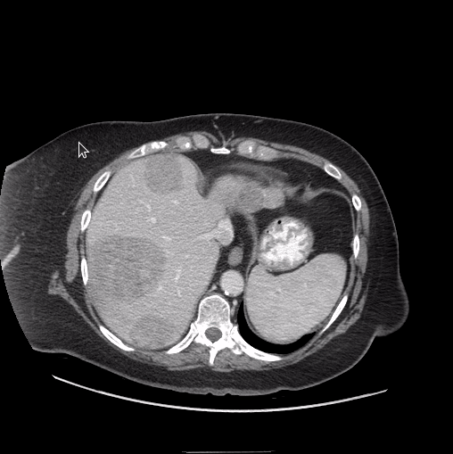

# MedSAM 
This is the official repository for MedSAM: Segment Anything in Medical Images.


## Installation 
1. Create a virtual environment `conda create -n medsam python=3.10 -y` and activate it `conda activate medsam`
2. Install [Pytorch 2.0](https://pytorch.org/get-started/locally/)
3. `git clone https://github.com/bowang-lab/MedSAM`
4. Enter the MedSAM folder `cd MedSAM` and run `pip install -e .`


## Get Started
Download the [model checkpoint](https://drive.google.com/drive/folders/1ETWmi4AiniJeWOt6HAsYgTjYv_fkgzoN?usp=drive_link) and place it at e.g., `work_dir/MedSAM/medsam_vit_b`

We provide three ways to quickly test the model on your images

1. Command line

```bash
python MedSAM_Inference.py # segment the demo image
```

You can also segment other images with the following flags
```bash
-i input_img
-o output path
--box bounding box of the segmentation target
```

2. Jupyter-notebook

We provide a step-by-step tutorial based on [CoLab](https://colab.research.google.com/drive/19WNtRMbpsxeqimBlmJwtd1dzpaIvK2FZ?usp=sharing)

You can also run it locally with `MedSAM_Inference.ipynb`.

3. GUI

```bash
python gui.py
```

Your can load the image to the GUI and specify segmentation targets by drawing bounding boxes
 


> Training tutorial will be available soon


## Acknowledgements
- We highly appreciate all the challenge organizers and dataset owners for providing the public dataset to the community. 
- We thank Meta AI for making the source code of [segment anything](https://github.com/facebookresearch/segment-anything) publicly available.
- We also thank Alexandre Bonnet for sharing this great [blog](https://encord.com/blog/learn-how-to-fine-tune-the-segment-anything-model-sam/)


## Reference

```
@article{MedSAM,
  title={Segment Anything in Medical Images},
  author={Ma, Jun and He, Yuting and Li, Feifei and Han, Lin and You, Chenyu and and Wang, Bo},
  journal={arXiv preprint arXiv:2304.12306},
  year={2023}
}
```
